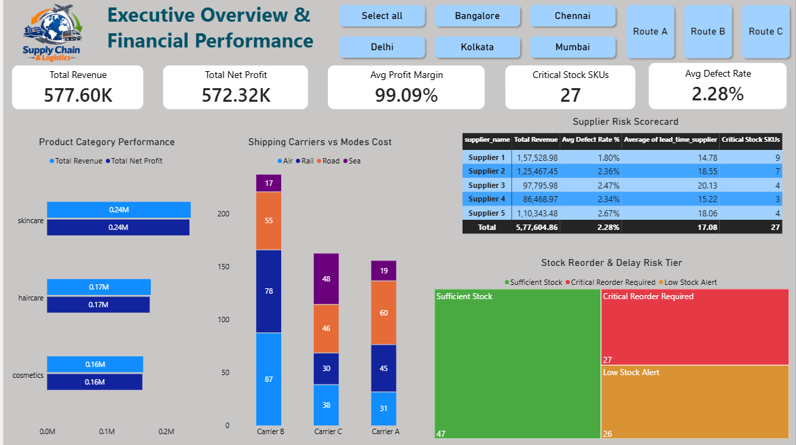
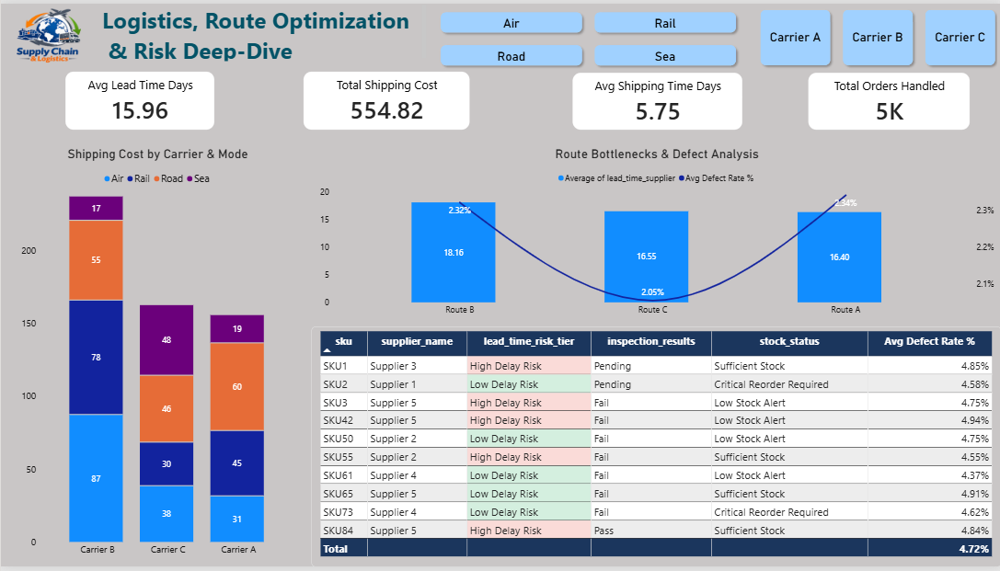

# Supply Chain & Logistics Analytics Dashboard

## Project Overview

This project analyzes end-to-end supply chain and logistics operational data to evaluate financial performance, supplier reliability, route bottlenecks, and inventory risk exposure. 
The project follows a complete Data Analytics workflow using Python for data cleaning & EDA, PostgreSQL for database storage and complex query analysis, and Power BI for relational data modeling and executive dashboard visualization.

## Business Problem

The supply chain and logistics management team needs to solve critical operational bottlenecks:
* Understanding overall revenue generation, net profit margins, and logistics cost distribution.
* Identifying high-risk suppliers driving elevated lead times and defect percentages.
* Pinpointing shipping carrier inefficiencies and route bottlenecks impacting delivery times.
* Tracking critical inventory reorder thresholds to prevent stockouts and operational delays.
* Establishing an interactive audit system for real-time risk assessment across SKUs and logistics routes.

## Business Objectives

* Inspect, clean, and validate raw supply chain data for quality and type consistency.
* Perform SQL query analysis to uncover supplier risk tiers, cost breakdowns, and lead-time anomalies.
* Calculate core KPIs including Total Revenue, Total Net Profit, Profit Margin %, Total Shipping Cost, Avg Defect Rate %, and Critical Stock SKUs.
* Categorize SKUs using DAX into dynamic risk tiers (`High Delay Risk` vs `Low Delay Risk`).
* Build a 2-page executive Power BI dashboard with seamless page navigation, custom slicers, and conditional formatting alerts.

## Dataset

* **Rows:** 100
* **Columns:** 28
* **Data Type:** Supply Chain & Logistics Operations Data
* **Key Fields:** `sku`, `product_type`, `price`, `availability`, `number_of_products_sold`, `revenue_generated`, `stock_levels`, `lead_times`, `order_quantities`, `shipping_times`, `shipping_carriers`, `shipping_costs`, `supplier_name`, `location`, `lead_time_supplier`, `production_volumes`, `manufacturing_costs`, `inspection_results`, `defect_rates`, `transportation_modes`, `routes`

## Tools & Technologies

| Tool | Purpose |
| :--- | :--- |
| **Python (Pandas, NumPy)** | Data cleaning, data type validation, missing value handling, and exploratory data analysis (EDA). |
| **PostgreSQL** | Relational database analysis, SQL schema design, KPI querying, and aggregate aggregations. |
| **Power BI Desktop** | Data modeling, DAX measure creation, UI layout design, and interactive dashboard development. |
| **DAX (Data Analysis Expressions)** | Custom KPIs (`DIVIDE`, `SUM`, `AVERAGE`, `COUNT`), conditional logic, and calculated risk columns. |
| **GitHub** | Version control, documentation, and portfolio showcase. |

## Project Workflow

* **Raw Dataset**,
* **Python Data Cleaning & EDA**,
* **PostgreSQL Analysis & Business Queries**,
* **Power BI Data Modeling & DAX Measures**,
* **Interactive 2-Page Power BI Dashboard**,
* **Business Insights & Operations Optimization Strategies**

---

## Python Analysis

Python was used for:
* Loading and validating raw supply chain data shapes (100 rows × 28 columns)
* Data type standardization and handling missing values across numerical/categorical fields
* Exploratory Data Analysis (EDA) on cost distribution, manufacturing expenses, and lead-time variances
* Validating relationships between defect rates, supplier locations, and carrier modes

**Python Notebook:** [01_data_cleaning_eda.ipynb](03_EDA_Analysis.ipynb)

---

## SQL Analysis

PostgreSQL was used for:
* Database table creation and schema definitions for raw operational metrics
* Calculating global business KPIs (Total Revenue, Total Shipping Costs, Average Defect Rate %)
* Grouping carrier performance by transportation mode (Air, Rail, Road, Sea)
* Ranking suppliers based on lead times and inspection failure rates

**SQL File:** [02_supply_chain_analysis.sql](04_SQL_Analysis.sql)

---

## Power BI Dashboard

The Power BI report contains two dedicated interactive pages:

### 1. Executive Overview & Financial Performance

Provides a high-level strategic overview of financial results and operational health:
* **Core KPIs:** Total Revenue, Total Net Profit, Avg Profit Margin %, Critical Stock SKUs, Avg Defect Rate %
* **Product Category Performance:** Revenue and Net Profit split across Skincare, Haircare, and Cosmetics
* **Shipping Carriers vs Modes Cost:** Stacked bar breakdown of transport expenses across Carriers A, B, and C
* **Supplier Risk Scorecard:** Matrix evaluating revenue, defect rates, average lead times, and critical stock counts per supplier
* **Stock Reorder & Delay Risk Tier:** Treemap showing inventory distribution by status (`Sufficient Stock`, `Critical Reorder Required`, `Low Stock Alert`)

### 2. Logistics, Route Optimization & Risk Deep-Dive

Focuses on operational logistics execution, route bottlenecks, and high-risk SKU management:
* **Logistics KPIs:** Avg Lead Time Days, Total Shipping Cost, Avg Shipping Time Days, Total Orders Handled
* **Shipping Cost by Carrier & Mode:** Cost comparison across transport modes (Air, Rail, Road, Sea)
* **Route Bottlenecks & Defect Analysis:** Combo chart mapping supplier lead time against defect rate percentages by route (Route A, Route B, Route C)
* **High-Risk SKU Audit Table:** Dynamic conditional formatting table highlighting SKUs with delay risks and inspection results

**Power BI Dashboard File:** [Supply_Chain_Analytics.pbix](05_Supply_Chain_Logistics_Analytics_Dashboard.pbix)

---

## Key KPIs

| KPI | Overall Result |
| :--- | :--- |
| **Total Revenue** | $577.60K |
| **Total Net Profit** | $572.32K |
| **Avg Profit Margin %** | 99.09% |
| **Critical Stock SKUs** | 27 SKUs |
| **Avg Defect Rate %** | 2.28% |
| **Avg Lead Time Days** | 15.96 Days |
| **Total Shipping Cost** | $554.82 |
| **Avg Shipping Time Days** | 5.75 Days |
| **Total Orders Handled** | 5K |

---

## Key Business Insights

### Financial & Product Category Performance
* **Revenue Drivers:** Skincare generated the highest revenue share ($0.24M), followed by Haircare ($0.17M) and Cosmetics ($0.16M).
* **Logistics Cost Impact:** Carrier B handles the highest shipping volume and cost burden across modes, predominantly driven by Road and Rail transport.

### Supplier Risk & Inventory Exposure
* **Supplier Performance:** Supplier 3 registers the highest average supplier lead time (20.13 days) and a defect rate of 2.47%.
* **Stock Criticality:** Out of 100 SKUs, **27 SKUs** are in **Critical Reorder Required** status, posing immediate stockout risks if reorders are delayed.

### Logistics Bottlenecks & Risk Tiers
* **Route Delays:** Route B exhibits the highest supplier lead time (18.16 days), whereas Route A shows elevated defect rates (2.34%).
* **Risk Concentration:** SKUs associated with Supplier 5 and Supplier 3 frequently cross into the `High Delay Risk` tier (lead times > 16 days).

---

## Business Recommendations

* **Optimize High-Lead-Time Routes:** Re-evaluate carrier contracts and transit schedules on Route B to bring down lead times from 18+ days to under 15 days.
* **Audit Supplier Quality Control:** Partner with Supplier 3 and Supplier 5 to enforce strict quality control checks, addressing defect rates above the 2.28% threshold.
* **Automate Critical Reorder Alerts:** Use the inventory alert model to trigger automated purchase orders for the 27 critical SKUs before safety stock levels drop further.
* **Carrier Cost Re-Negotiation:** Shift low-priority cargo from high-cost Air freight to Rail/Sea transport where shipping lead times allow.

---

---

## Dashboard Preview

### Executive Overview & Financial Performance

### Logistics, Route Optimization & Risk Deep-Dive

